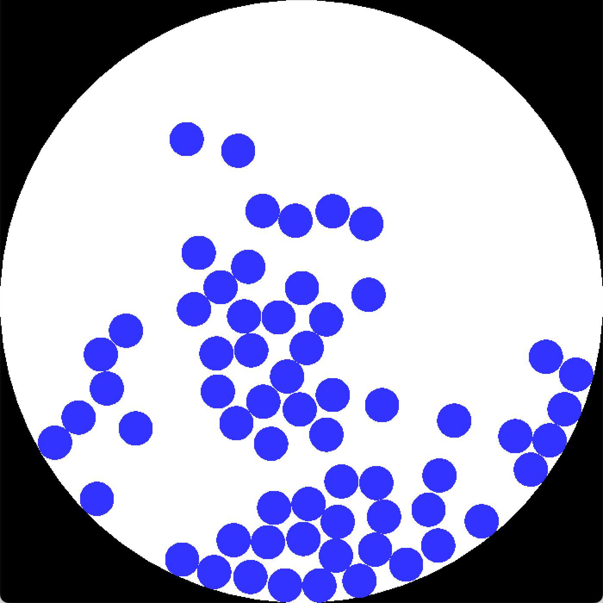

# Physics Tests

Simple 2D physics simulations written in Haskell. Currently there are three, which you can run by passing the name as an argument to the executable\*:

* "implicitdown": downward gravity, implicit Verlet collision handling
* "implicitspace": gravitating balls, implicit Verlet collision handling
* "elasticspace": gravitating balls, elastic collisions

The first two use previous-position Verlet integration, and the last uses velocity Verlet integration. "Implict Verlet collision handling" means that when two balls overlap, they are moved apart just enough that they don't overlap anymore. Their new velocities are dependent on the amount by which they happened to overlap. (So if a new ball is added on top of an existing ball, they will fly apart.) You can add new balls by clicking.

I was inspired by [this video](https://www.youtube.com/watch?v=lS_qeBy3aQI).

\*You can also pass flags to control some parameters, but I don't feel like documenting those right now.